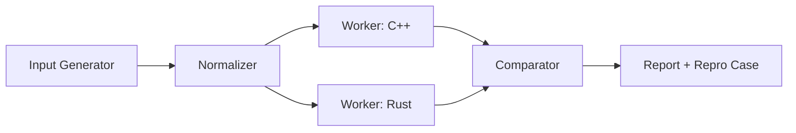

# SP-DIFFER

**Differential testing for Silent Payments (BIP 352).**

> Privacy only works when implementations agree.

SP-DIFFER is a correctness harness that compares multiple Silent Payments implementations and turns any mismatch into a minimal, reproducible test case. It is built for maintainers who want confidence that wallets will interoperate safely.

---

## Why This Exists

Silent Payments are subtle. The hardest bugs are the ones that look fine in unit tests but break in the wild. Differential testing is the fastest way to surface those cracks:
- Key aggregation edge cases that silently diverge.
- Sorting and normalization mistakes that change recipient keys.
- Taproot negation or scalar handling bugs that can lose funds.

SP-DIFFER makes those failures deterministic, explainable, and fixable.

---

## What This Repo Is Right Now

This repository currently ships project documentation and a scaffolded structure for the future implementation. The code is staged and will land in phases.

Start here:
- `docs/PROJECT.md`
- `docs/ARCHITECTURE.md`
- `docs/NORMALIZATION.md`
- `docs/TESTING.md`
- `docs/ROADMAP.md`
- `spec/FORMAT.md`
- `spec/ERRORS.md`
- `SP-DIFFER_PROJECT_SPECIFICATION.md`

---

## What It Will Deliver

- A deterministic test harness that compares independent implementations.
- A strict normalization contract to avoid false positives.
- Reproducible artifacts for every mismatch.
- A growing corpus of regression cases.

---

## How It Works

GitHub renders the Mermaid diagram below. If it does not render in your viewer, the ASCII flow right after it shows the same pipeline.



```text
Input Generator -> Normalizer -> Worker: C++ -> Comparator -> Report + Repro Case
                               -> Worker: Rust ->
```

---

## Repository Layout

- `docs/` Project documents and rationale.
- `spec/` Canonical case and error format definitions.
- `src/` Future implementation of core logic, CLI, runner, and reporter.
- `workers/` Per-implementation adapters for C++ and Rust.
- `ffi/` Stable C ABI boundary for worker integration.
- `tests/` Vectors and regression cases.
- `fuzz/` Fuzzing harnesses and corpus.
- `scripts/` Helper scripts for repeatable workflows.

---

## Design Principles

- Deterministic runs by default.
- Explicit normalization rules.
- No silent failures.
- Minimal reproduction cases for every mismatch.
- Tooling that works in CI without drama.

---

## Scope

In scope:
- Differential testing of Silent Payments derivation.
- Official test vectors and property checks.
- Deterministic fuzzing with reproducible seeds.

Out of scope:
- Full wallet integration.
- Transaction creation or broadcasting.
- Network and database layers.

---

## Roadmap Snapshot

- Phase 0: finalize input format, normalization rules, and wrappers.
- Phase 1: build a minimal CLI and test vector runner.
- Phase 2: add fuzzing harness and corpus management.
- Phase 3: CI integration and additional implementations.

---

## Contributing

If you are implementing Silent Payments, reviewing BIP 352, or building wallet infrastructure, we welcome feedback and test cases. The most useful contributions right now are:
- Edge cases real wallets might hit.
- Spec clarifications that reduce ambiguity.
- Review of normalization rules.

---

## Security

SP-DIFFER is a testing framework. It is not a wallet and it does not handle production keys. Any keys used in tests must be disposable.

---

## License

Documentation and project artifacts will be released under a permissive open-source license once the implementation lands.

---

## Tagline

**Make Silent Payments safe before they are popular.**
