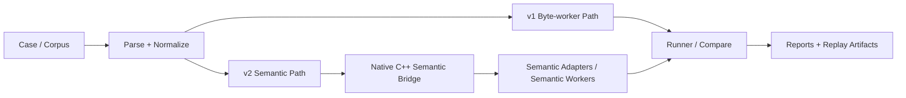

# SP-DIFFER

[](https://github.com/shuv-amp/sp-differ/actions/workflows/ci.yml)

Differential testing for Silent Payments (BIP 352).

SP-DIFFER is a correctness harness that compares multiple Silent Payments implementations and turns mismatches into reproducible test cases.

## Core Functionality

- **Parsing & Validation**: Supports v1 and v2 case formats with normalization and structural validation.
- **Differential Execution**: Drives independent implementations through a unified semantic contract.
- **Reference Oracle**: Uses the vendored BIP352 reference flow as the semantic baseline.
- **Regression Analysis**: Stores and replays mismatch artifacts to prevent regressions.
- **Deterministic Fuzzing**: Runs structured and raw mutation lanes for adapters and workers.

## Scope

- **In-Scope**: BIP352 sender/receiver behavior, official vector projection, and deterministic regression testing.
- **Out-of-Scope**: Wallet UI, network services, transaction broadcasting, or persistent wallet state management.

## Quick Start

For a first local validation pass:

```bash
make lint
make build
make test
make smoke
```

For release packaging and integrity checks:

```bash
make release
./build/release/sp_differ_cli --check-integrity --json-out build/release_check_integrity.json --markdown-out build/release_check_integrity.md
make package-release
make verify-packaged-release
# after downloading a CI-built public archive:
python3 scripts/verify_release_attestation.py build/sp-differ-v1.0.0-linux-x64.tar.gz --repo shuv-amp/sp-differ --source-ref refs/tags/v1.0.0
```

To exercise signet-style address/export handling from a receive case:

```bash
./build/sp_differ_cli --export-wallet \
  --network signet \
  --case tests/vectors/bip352/derived/v2/official_case_19_receive_00.hex \
  --json-out build/signet_wallet_export.json \
  --markdown-out build/signet_wallet_export.md
```

If you prefer the Python operator wrapper for the broader release gate, keep using:

```bash
python3 -m pip install --editable .
sp-differ verify --profile release
sp-differ verify --profile release --refresh-external-probe
sp-differ status --profile release --require-green
```

For a direct pipeline run without the CLI wrapper:

```bash
make lint
make check
make adapters
make regressions
make fuzz-semantic-workers FUZZ_STRUCTURED_ITERATIONS=64 FUZZ_RAW_ITERATIONS=64
make fuzz-semantic-adapters FUZZ_STRUCTURED_ITERATIONS=64
make sanitize-smoke SANITIZE_CXX=clang++
```

For harness-level performance baselines on the same pinned corpus:

```bash
make bench-adapters BENCH_ITERATIONS=3 BENCH_WARMUP=1
make bench-scan-native BENCH_SCAN_BLOCKS=1000 BENCH_SCAN_DENSITY=all
```

For the local release sign-off lane:

```bash
make maturity-signoff
```

To re-check the published evidence bundle against current on-disk files:

```bash
make verify-release-evidence
```

## Dependencies

Required native libraries:

- `libsecp256k1`
- `OpenSSL`

Verified locally with:

- macOS (Homebrew): `secp256k1 0.7.1`
- macOS (Homebrew): `openssl@3 3.6.1`
- Linux x86_64 (Ubuntu): `libsecp256k1-dev 0.2.0-2`
- Linux x86_64 (Ubuntu): `libssl-dev 3.0.13-0ubuntu3.7`

Toolchain surfaces exercised by `make test`:

- Python runtime `>=3.9`; the preferred CI and local version file is `.python-version` (`3.11`)
- Rust `1.92.0`, pinned in `rust-toolchain.toml`
- Go `1.24.1` for the Go semantic adapter, pinned in `adapters/go_bip352/go.mod`

## Platform Support

- CI-verified today: Linux x86_64, Linux arm64, and macOS via a universal release build.
- Release packaging today: Linux x64, Linux arm64, and macOS universal tarballs.
- Windows-specific branches remain in the Makefile for portability work, but Windows is not currently CI-verified or release-supported.

## Result Interpretation

- Release readiness and scorecards are evidence summaries from this harness.
- Benchmark summaries are also evidence summaries from this harness.
- They are not universal claims about every implementation on the internet.
- Use language such as "measured in this harness" when sharing results.
- For live sign-off, prefer `sp-differ verify --profile release --refresh-external-probe` or `make verify-release-live` when the repo carries external-probe candidate metadata. Repos without that metadata still produce a live readiness report, but upstream freshness is left unevaluated.

## How It Works


```mermaid
flowchart LR
  A[Case / Corpus] --> B[Parse + Normalize]
  B --> C[v1 Byte-worker Path]
  C --> D[Runner / Compare]
  B --> E[v2 Semantic Path]
  E --> F[Native C++ Semantic Bridge]
  F --> G[Semantic Adapters / Semantic Workers]
  G --> D
  D --> H[Reports + Replay Artifacts]
```

```text
Case / Corpus -> Parse + Normalize -> v1 Byte-worker Path -> Runner / Compare -> Reports + Replay Artifacts
Case / Corpus -> Parse + Normalize -> v2 Semantic Path -> Native C++ Semantic Bridge -> Semantic Adapters / Semantic Workers -> Runner / Compare -> Reports + Replay Artifacts
```

The harness has two execution paths. The v1 byte-worker path runs the C++ and Rust workers directly and compares their raw output. The v2 semantic path runs independent adapter implementations against the vendored BIP352 reference oracle and compares results.

## Known Scope

The v1 byte-worker handles P2WPKH, P2TR keypath, and P2SH-P2WPKH input types. P2PKH is not implemented in the v1 worker. The v1 path is retained for byte-worker parity checks; the broader BIP352 coverage lives in the v2 semantic path. The v2 semantic path covers P2PKH through the reference adapter.

## Repository Layout

- docs/: project docs and architecture notes.
- spec/: case formats and semantic contracts.
- src/: C++ runner/compare implementation.
- workers/: worker implementations and ABI glue.
- adapters/: semantic adapters for external implementations.
- tests/: vectors and regressions.
- fuzz/: corpus and fuzz runners.
- scripts/: verification, regression, and artifact tooling.

## Design Principles

- Deterministic runs by default.
- Explicit normalization rules.
- Replayable reproduction artifacts for the mismatch paths this harness exercises.

## Key Documents

- [docs/README.md](docs/README.md)
- [docs/DEVELOPMENT.md](docs/DEVELOPMENT.md)
- [docs/ARCHITECTURE.md](docs/ARCHITECTURE.md)
- [docs/BENCHMARKING.md](docs/BENCHMARKING.md)
- [docs/RELEASE.md](docs/RELEASE.md)
- [docs/TESTING.md](docs/TESTING.md)
- [docs/REFERENCE_ORACLE.md](docs/REFERENCE_ORACLE.md)
- [spec/SEMANTIC_ADAPTER.md](spec/SEMANTIC_ADAPTER.md)
- [spec/SEMANTIC_CONTRACT.md](spec/SEMANTIC_CONTRACT.md)
- [spec/ERRORS.md](spec/ERRORS.md)

## Credits

SP-DIFFER builds on upstream specifications and implementation work from the Bitcoin and Silent Payments ecosystem.

- BIP 352 specification and reference implementation from bitcoin/bips.
- Rust implementation ecosystems used by adapters, including silentpayments, silent-payments, bip352, and bdk-sp.
- Go implementation used by adapter integration: go-bip352.
- secp256k1 cryptographic library ecosystem used by multiple components.

Primary upstream links:

- [BIP 352 specification](https://github.com/bitcoin/bips/blob/master/bip-0352.mediawiki)
- [BIP 352 reference implementation](https://github.com/bitcoin/bips/blob/master/bip-0352/reference.py)
- [silentpayments crate docs](https://docs.rs/silentpayments/latest/silentpayments/)
- [silent-payments crate page](https://lib.rs/crates/silent-payments)
- [bip352 crate docs](https://docs.rs/bip352/latest/bip352/)
- [bdk-sp repository](https://github.com/bitcoindevkit/bdk-sp)
- [go-bip352 repository](https://github.com/setavenger/go-bip352)
- [libsecp256k1 repository](https://github.com/bitcoin-core/secp256k1)

Credit goes to the original maintainers and contributors of those upstream projects.

If you use this repository in reports or tooling, please cite both SP-DIFFER and the upstream implementations you exercised.

## Implemented Surfaces

- Native compiled runner, comparator, CLI, and reporter in `src/`.
- Native C++ and Rust worker libraries behind stable ABI headers in `ffi/`.
- Differential adapter coverage for reference, Rust, Go, and `bdk-sp` integrations.
- Deterministic regression, fuzz, benchmark, and release-verification lanes wired through `Makefile`.
- Signed release packaging instructions and public verification material in `SIGNING.md` and `KEYS`.

---

## Contributing

If you are implementing Silent Payments, reviewing BIP 352, or building wallet infrastructure, feedback and test cases are welcome. The most useful contributions are:
- Edge cases real wallets might hit.
- Spec clarifications that reduce ambiguity.
- Review of normalization rules.

## Security

SP-DIFFER is a testing framework. It is not a wallet and it does not handle production keys. Any keys used in tests must be disposable.

Treat the Silent Payments `ScanSecretKey` exactly like wallet seed material. Anyone who obtains it can correlate and recover wallet-relevant scanning state. The compiled CLI therefore writes exported private keys only to explicit output files and does not print them to stdout during normal operation.

For performance measurements or release verification, prefer the binaries produced by `make release` so the measured artifacts match the packaged release build. This does not imply any constant-time or side-channel guarantee.

## License

Licensed under the MIT License. See LICENSE for details.
